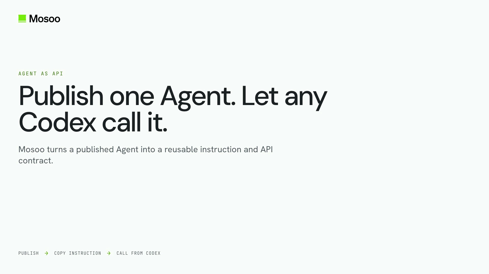

<p align="center">
  <picture>
    <source media="(prefers-color-scheme: dark)" srcset="./docs/assets/logo-wordmark-white.svg">
    <source media="(prefers-color-scheme: light)" srcset="./docs/assets/logo-wordmark.svg">
    
  </picture>
</p>

# Codex Pet

Upload one avatar and download a Codex-compatible animated pet. A Cloudflare Worker serves the page and calls one published Mosoo Agent; `MOSOO_API_TOKEN` never reaches the browser.

## Agent as API

Publish a Mosoo Agent once and let any Codex call it. This 57-second demo shows Codex consuming the generated **Instruction for LLM**, integrating the Mosoo Thread API into an existing product backend, and turning one uploaded avatar into a validated pet ZIP.

[](./docs/assets/mosoo-agent-as-api.mp4)

[Watch the Agent as API demo →](./docs/assets/mosoo-agent-as-api.mp4)

```text
Browser -> Cloudflare Worker -> Mosoo Public Thread API -> Agent sandbox
                                                        -> outputs/codex-pet.zip
```

## Setup

1. Publish a Mosoo pet Agent and attach the bundled `hatch-pet-mosoo` skill.
2. Give its environment the `openai` and `pillow` Python packages and an OpenAI provider credential that exposes `OPENAI_API_KEY`.
3. Install dependencies and configure local Worker variables:

```bash
bun install
cp .dev.vars.example .dev.vars
bun run package:skill
bun run dev
```

Set `MOSOO_API_BASE`, `MOSOO_AGENT_ID`, and `MOSOO_API_TOKEN` in `.dev.vars`. The browser uploads an image, the Worker creates a Mosoo Thread with a file resource, polls it, and streams `outputs/codex-pet.zip` back when the Run completes.

## Deploy

The Worker can call Mosoo Cloud directly. For a local Mosoo development stack, expose only `/api/v1/*` through the included gateway and a Cloudflare Tunnel:

```bash
bun run dev:gateway
cloudflared tunnel --url http://127.0.0.1:8790
```

Store the token as a secret, then deploy with the public API base and published Agent ID as Worker vars:

```bash
bunx wrangler secret put MOSOO_API_TOKEN
bun run deploy -- --var MOSOO_API_BASE:https://your-mosoo.example/api/v1 \
  --var MOSOO_AGENT_ID:01J00000000000000000000001
```

Quick Tunnel URLs change after restart. Use a named Tunnel for a stable demo URL. See [WORKAROUNDS.md](./WORKAROUNDS.md) for the integration issues found during the first end-to-end run.

## Checks

```bash
bun run cf:types
bun run tc
bun run lint
bun run test
bun run build
bun run package:skill
python3 -m py_compile skill/hatch-pet-mosoo/scripts/*.py
unzip -t hatch-pet-mosoo.skill
```

The reference smoke produced all nine animation rows, repaired one QA-detected empty frame, downloaded the ZIP through the Worker, and independently validated the `1536x1872` RGBA WebP atlas with no errors or warnings.
